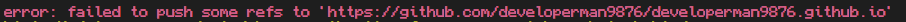

<h1 align="center">Hi 👋, I'm @developerman9876</h1>

- 🔭 I’m currently working on **Scripts**

- 🌱 I’m currently learning **Lua**

- 👯 I’m looking to collaborate on **Doors**

- 🤝 I’m looking for help with **Lua**

- 📫 How to reach me

<h3 align="left">Languages and Tools:</h3>

  

&nbsp;

